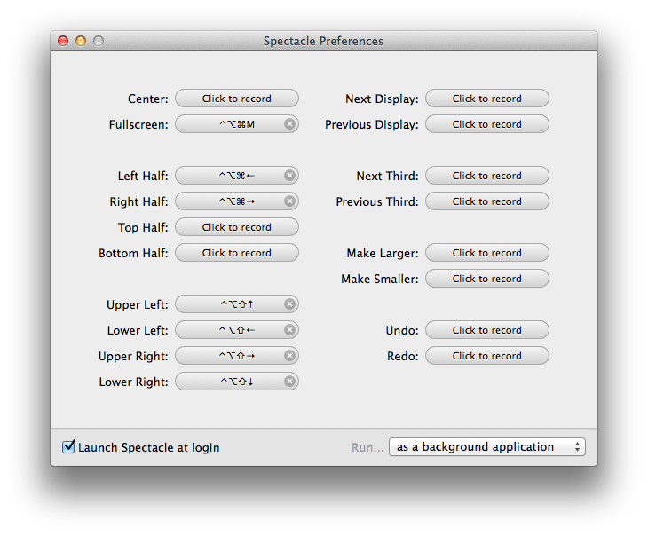

# Setup Guide

## OS X

### Dock

1. The Applications folder should be added to the Dock. It should be set to display as "Folder", not "Stack".
2. All applications should be removed from the Dock except those used most often (Google Chrome, Sublime Text 2, Terminal, etc.).
3. The Dock should be set to automatically hide and show itself.
  - System Preferences > Dock > "Automatically hide and show the Dock" should be checked

### Misc.

1. The caps lock key should be disabled.
  - System Preferences > Keyboard > Modifier Keys... > Assign "No Action" to Caps Lock Key
2. Natural scrolling should be turned off.
  - System Preferences > Trackpad > Scroll & Zoom > "Scroll direction: natural" should be unchecked
3. The Spotlight menu keyboard shortcut should be turned off.
  - System Preferences > Keyboard > Shortcuts > Spotlight > Uncheck "Show Spotlight search" and "Show finder search window"
4. The display brightness should be set to not automatically adjust.
5. Enable zoom.
6. Swipe between pages should be turned off.
  - System Preferences > Trackpad > More Gestures > "Swipe between pages" should be unchecked

### Security

1. FileVault should be turned on.
2. The guest account should be disabled.
3. Allow apps to run that have been downloaded from anywhere.

### Terminal

1. The [Solarized theme](http://ethanschoonover.com/solarized) (dark) should be downloaded and installed.
2. Install Xcode command line developer tools.
3. Install [Homebrew](http://brew.sh/). Homebrew should be used for installing Git and node.js so they can be easily updated. `/usr/local/bin` should be prepended to the PATH environmental variable so that the Homebrew installed Git will be used.
4. The font size should be changed to 14 pt.

#### Dotfiles

1. `.bash_profile`
2. `.gitconfig`
3. `.gitignore`
4. `.vimrc`

## Applications

### [Alfred App](http://www.alfredapp.com/)

Alfed App should be downloaded and installed. Alfred App should be used as a replacement to Spotlight.

### [Google Chrome](https://www.google.com/intl/en/chrome/browser/)

Google Chrome should be downloaded and installed.

### [Mou](http://mouapp.com/)

Mou should be downloaded and installed.

### [Spectacle](http://spectacleapp.com/)

Spectacle should be downloaded and installed. It should be set to launch at login and should run as a background application. The appropriate hotkeys should be set.



### [Sublime Text 2](http://www.sublimetext.com/)

Sublime Text 2 should be downloaded and installed. Install [Package Control](https://sublime.wbond.net/).

#### Theme

[Soda Light](http://buymeasoda.github.io/soda-theme/)

#### Plugins

1. GitGutter - Displays Git diff in gutter
2. LESS - LESS syntax highlighting

#### Settings

```
{
    "draw_white_space": "all",
    "ensure_newline_at_eof_on_save": true,
    "font_size": 13.0,
    "highlight_modified_tabs": true,
    "scroll_past_end": true,
    "trim_trailing_white_space_on_save": true,
    "word_wrap": false
}
```

#### Key Bindings

```
[
	{ "keys": ["super+shift+w"], "command": "toggle_setting", "args": { "setting": "word_wrap" } }
]
```
